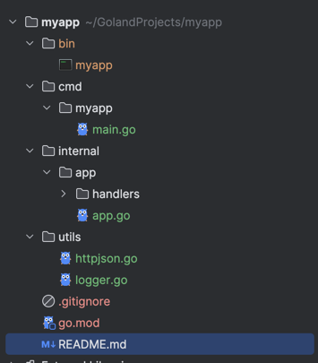
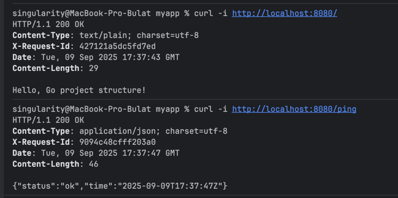
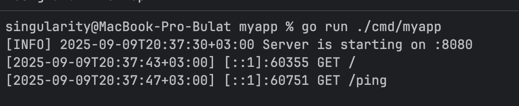
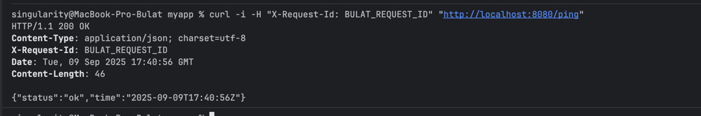

# Практическая работа №2
**Студент:** Саттаров Булат Рамилевич  

### Скриншоты

#### Структура проекта

#### Запросы

#### Логи

#### Заголовок

### Запуск
```bash
go mod tidy
go run ./cmd/myapp
```
После запуска сервис доступен на `http://localhost:8080/`.

---

## Артефакты

1. **configs/** — сюда нужно складывать примеры и шаблоны конфигураций (например, `config.yaml`). Это удобно для CI/CD и быстрой настройки окружений.  
2. **api/** — папка для OpenAPI/Swagger или protobuf-схем. Это отделяет контракт API от кода обработчиков и делает проект прозрачным для других команд.  
3. **scripts/** — все утилиты для сборки и обслуживания (shell-скрипты, PowerShell). Это разгружает `Makefile` и делает рутинные задачи удобными.  
4. **deployments/** — шаблоны деплоя: `docker-compose.yml`, Helm-чарты, Terraform. Такой порядок позволяет запускать проект в разных средах без изменений в коде.  
5. **docs/** — сюда выносятся README, инструкции и архитектурные схемы. Это полезно для новых участников проекта и упрощает сопровождение.  

Такое разделение артефактов помогает не смешивать код и инфраструктуру, делает проект масштабируемым и понятным.  
